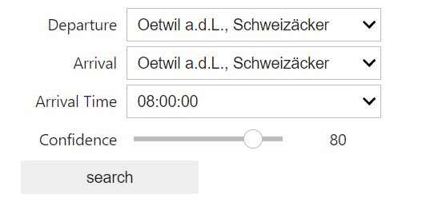
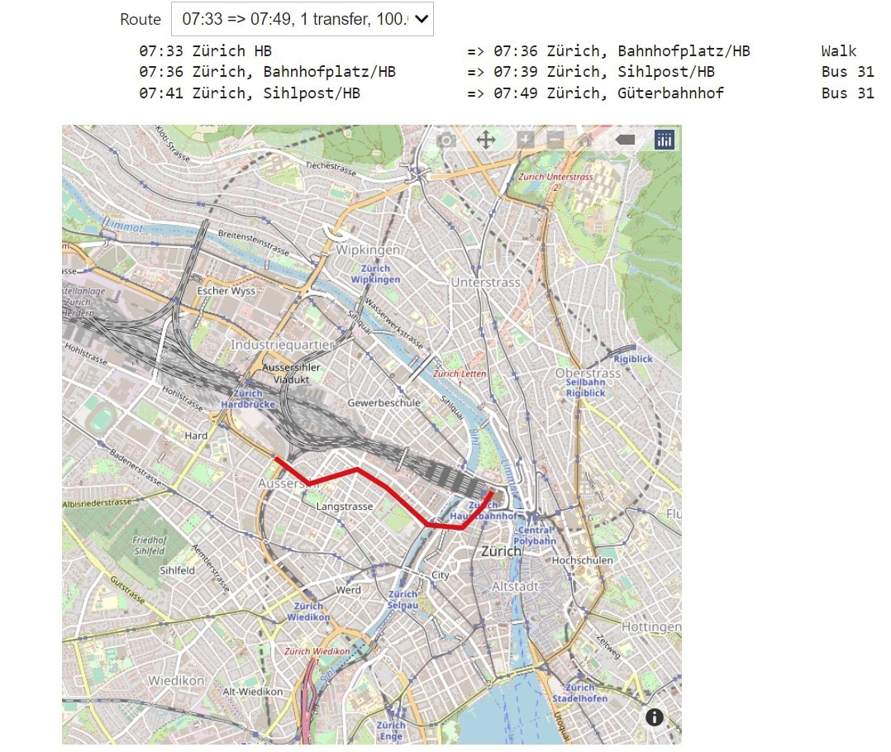
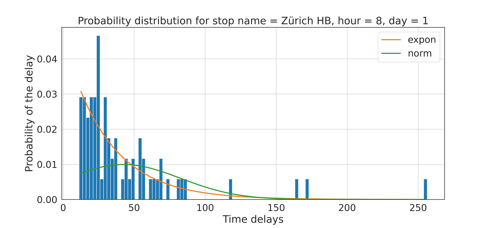
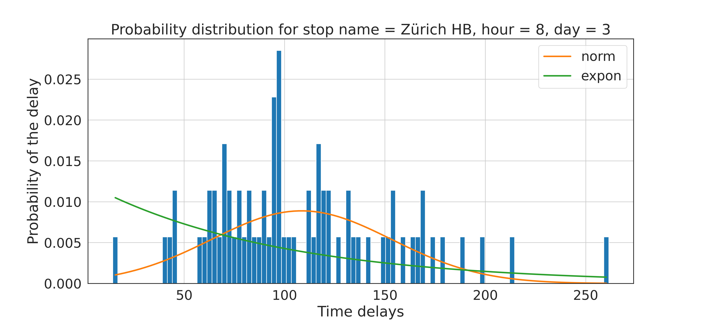

# Route planner with uncertainty of delay
This is a repository for the final project of COM-490. A route planner is develped for query available routes between two stations within 15km radius of ***Zürich HB***. By providing the departure station, arrival station, expected arrival time and success transfer confidence, the user can get serval route choices from the planner.

<!-- #region -->
The group members of this project are:

* [Pin-yen Huang](pin-yen.huang@epfl.ch)
* [Xinling Li](li.xinling@epfl.ch)
* [Yu-Hsin Yang](yu-hsin.yang@epfl.ch)
* [Cédric Fontaine​](cedric.fontaine@epfl.ch)

----
## Content

* [Repository Files](#Repository-Files)
* [HOW-TO](#HOW-TO)
* [Predictive Model](#Predictive-Modle)
* [Route Planning Algorithm](#Route-Planning-Algorithm)
* [References](#References)

----
## Repository Files

`notebooks/` contains the following files:

- `csa.py`: Implementation of the routing algorithm
- `data_preparation.ipynb`: Data processing for getting the data for the routing algorithm
- `filter_stops.ipynb`: 
- `main.ipynb`: Entrance of the route planner, contains the user interface
- `delay_calculation.py`: Calculate the delay probablity
- `database_for_delays.py`: Creating the database for computing the delays
- `distribution_plots.py`: Creates the plots for visualizing distributions
- `distribution_fitting.py`: Pipeline for fitting the distributions 
- `distribution_fitting_parallel.py`: More efficient pipeline to fit distributions if several cores are available, to be run on the command line
----

## HOW-TO
This repository is developed to be run on Renku. To use it, first load the repository on Renku. Then, navigate into the final-assignment folder, open a terminal, pull the data files by the following command:
```bash
git lfs pull
```
Then go to `main.ipynb`, run cells from the first one to the last, you will be able to see the following interface:
<p align="center"></p>
Select departure, arrival, arrival time and confidence, click search, the result will be shown as follows:
 <p align="center"></p>
 You can select different routes in the dropdown list to visualize.

<!-- #endregion -->

<!-- #region -->
----
## Predictive Model

### How do we form a predictive model?

Take the **previous delay data**, and try to find the **correlation** inside the data itself.

### What data do we use ?

The ```istdaten``` dataset contains all information about public transport arrival and departure times, and is available for 2018, 2019, 2020 and 2021. However, since the target week is from the **13.05.2019** to the **17.05.2019**, we will only use data with a date happening ***before*** this week, i.e. data from the **01.01.2018** to the **12.05.2019** in order to have as much data as possible. More specifically, our dataset pre-processing procedure allows to have delay distributions which are collected ***weekly***, hence the more weeks we have in our dataset, the more data there will be for each distribution, as will be further explained later on.

## Data preprocessing

### General operations

We first filter the stops within 15 km radius from Zurich HB and preform an ```inner join``` with ```istdaten``` data (ranging from 2018.01 to 2019.05) to get a target dataframe. 
Then, we preform a cleaning on the dataset (e.g. fillna, remove the outlier data, etc...) as well as calculate the delay of each row of data (*to avoid becoming over-optimistic, we only consider the arrival delay*).
Since our goal is to classify the delays by hour of the day, day of the week and stop name, we add the two first features to the dataset.
After that, we further reduce the size of the dataframe by selecting only the columns we which we need, which are the actual features (```hourOfDay```, ```dayOfWeek``` and ```stop_name```) as well as the columns over which we don't want to aggregate and which will thus form the *meat* of our data (only the ```date``` in this case, but the ```transport_ID``` might as well be added too, as will be discussed later). We then group by value of these columns and aggregate on the ```mean``` of the arrival delay to form our final dataset.  

### Selecting Features

Here, we are going to briefly explain how the selected features influence the total delay.
We examined the whole dataset as well as combined some common knowledge to reach the final result.

- ```hourofday```: The delay in the rush hour (e.g. 8h and 17h) are mostly higher than that in the off-peak hour.
- ```dayofweek```: The delay in weekends are vary from delay in weekdays since more people are traveling in weekends.
- ```stop_name```: The delay in a busy station such as Zurich HB is definitely going to be bigger than that in a small city.

### Distributions fitting for delays data

Now having the delay data which we needed for fitting distributions, the latter task shall now be explained. 

### Distribution type choice

First, it can be argued that the delays occuring in transportations are quite similar to those happening in queues for representing service time. Indeed, delays in transportations are mainly either caused by lots of people wanting to get onto the train or bus, or by trains being slowed down by other trains circulating before them. Therefore, it makes sense up to a certain extent to use the same distribution for modeling these delays as the one commonly used for modeling queue service time. The exponential distribution is one of the most important in queueing theory, and many scientific articles or [web pages](https://people.revoledu.com/kardi/tutorial/Queuing/Service-Time-Distribution.html) help to convince one that this is the case.

Thus, exponential distributions can be fitted for each entry of our dataset, i.e. for each distribution corresponding to a specific ***day of the week***, ***hour of the day*** and ***stop name*** (about **160000 distributions to fit**). But before going into the actual distibution fitting procedure, let us consider the plots presented below, where delays distributions at ***Zürich HB*** at ***8 am*** have been fitted on ***Monday*** and on ***Wednesday***, using the ```distribution_plots.ipynb``` notebook. 

<p float="left">
  
   
</p>

On the left picture, it can be observed that an exponential distribution clearly fits quite well the present distribution, while on the right picture it does much worse. In the aim of preventing such bad fittings to happen, another common distribution has been added in order to form some sort of ***distribution library***. The choice of the ***normal distribution*** was supported by **[1]** and **[2]**, which show the respective performance of many different distributions. Moreover, it can be visually seen, that using a normal distribution for the right case provides a better result than when using an exponential one.

Choosing the right distribution really just depends on the data at hand, hence a metric has to be defined for providing a decision once both distributions have been fitted. In the present case, a simple ***sum of squares*** loss has been used in order to characterize the discrepancy between the fitted distribution and the actual one. Other, such as the ***BIC*** or the ***AIC*** might as well be used if the performance is not satisfying. Also, if more time was allowed, many more distributions would have been added to the distributions library since the current implementation allows it very easily. Only the query function would have to be changed by adding a filter to compute the right delay given a confidence.


### Delay prediction 

The distribution fitting procedure is described and implemented in the notebook ```distributions_fitting.ipynb```. The pre-processed dataframe is load into a ```pandas``` dataframe, which is then used to query the distributions. These are then fitted serially using a querying procedure made for enhancing the processing speed. Also, a ***parallel implementation*** of the same code can be found in ```distributions_fitting_parallel.py```. Here, the library ```multiprocessing``` has been used in order to launch processes on each thread of the machine in use. Note that is thus has to be launch for the command line and the file to be processed is specified at the very beginning of the file. The results are then stored into ```./data/dist_all_both.csv```.


Since we've already pre-computed the best fitted distribution in ```./data/dist_all_both.csv```, we can now create a new dataframe with the delay probability, based on this data. (The calculation process is in the notebook)The calculation is performed by examining the **Cumulative Distribution Function(cdf)** of the given distribution. **From the probability course, we know that, for a given value X, the probability of a variable falls under X is the corresponding value in cdf.**  
With this, we can easily calculate the probability for a given delay and a given probability distribution and then feed it to our Route Planning Algorithm.  

### Limitations of our predictive model

Here are a few points which would certainly improve the performance of our algorithm :

* The aggregation for computing the average delay was performed by grouping by ```hourOfDay```, ```dayOfWeek``` and ```stop_name```. However, the might not be the optimal solution since it drastically reduces the quantity of data used for fitting distributions (there are about 71 delays per entry, because there are one per week). Perhaps grouping by ```morning```, ```afternoon``` and ```evening``` would save a bit of data while reducing the total number of distributions to be fitted (160000 for now)
* Grouping by ```transport_type``` instead of aggregating over it would also have helped increasing the quantity of data per fitted distribution. The choice of not doing it was performed because it leads to more meaningful delay data (taking the mean of the transport types), but the converse choice could also be justified.
* Many more distributions could easily be added to the distribution library, as found in the cited papers, in order to enhance the fitting performance.
* The current implementation has a drawback : since distributions are fitted per day and per hour, it happens that little to no data is available for the fitting procedure. In these cases, the algorithm states that no distribution could be fitted and no probability can be outputed when the planner queries these points. In principle, this shouldn't be a huge issue since these points do correspond to stops that are never used at these hours of the day. The only problem occurs when only a few datapoints are available, in which case a poor distribution is fitted. In order to improve that, grouping by region of the day might surrogate this issue.


----
## Route Planning Algorithm
 We implemented the Connection Scan Algorithm (CSA) proposed in [this paper](https://i11www.iti.kit.edu/extra/publications/dpsw-isftr-13.pdf) with some modification. Please refer to the original paper for a complete explanation of the algorithm. Here we only provide a high-level concept of how it works without going into the details nor proving its correctness.

We prepare the :  Each station maintains a list of "non-dominated" itineraries from itself to the destination. In order to consider inter-station transfers, we also store a dictionary mapping each station id to a list of its nearby stations and its walking time.

To model the timetable, we create a list of "connections". An connection is a segment of a train's trajectory (e.g. If a train drives from station A to D stopping at B, C along its way, then we break it into 3 connections: A→B,  B→C, C→D).

We sort the connection according to its departure in descending order, then we iterate over the connections with the following operations:

For each connection (denoted as `conn`):

- Retrieve the itineraries to get from `conn.end_station` (and stations within walking distance of `conn.end_station`) to the destination.
- Extend the returned itineraries with `conn`, so the itineraries becomes from `conn.start_station` to the destination. If taking `conn` and the itinerary requires transfering, we increment the transfer count and updates its confidence by our delay model. 
- Update the itineraries stored in `conn.start_station` with the newly extended itineraries, only keeping non-dominated ones.

After we iterate over all the connections, each station will have a list of non-dominated itineraries starting from itself to the destination station.

### Limitations of our method

**Generating connections requires time.​**
A large portion of the time is spend at loading the timetable (connections). But if there is enough memory to load the connections of the whole day, then we just need to load once and they can be reused. 

**Routing algorithm only finds itinerary within 2-hour window.​**
We assume that within the 15km radius of Zürich HB, every origin-destination pair can be reached within 2 hours (considering its a small region with frequent services). However, this assumption can be relexed by increasing the time window with some performance tradeoff. 

**Routes partially outside the perimeter are not considered .​**
We filtered out the stops and train segments outsize this perimeter during data pre-processing. Therefore itineraries travelling outside the perimeters are not returned. This can also be relaxed by setting a larger radius. Again, it comes with a performance tradeoff since the amount of data is increased.

**Only arrival delays are considered.​**
When computing the transfer confidence, we always assume that the next train departs ontime and calculate the confidence solely based on the delay probability of the previous train. But this method overestimates the probability of missing a transfer. 

 ----
 ## References
 
**[1]** Beda Büchel and Francesco Corman, *Modelling Probability Distributions of Public Transport Travel Time Components*, 18th Swiss Transport Research Conference, May 2018

**[2]** M.M. Harsha and Raviraj H. Mulangi, *Probability distributions analysis of travel time variability for the public transit system*, International Journal of Transportation Science and Technology, October 2021
 
<!-- #endregion -->

```python

```
